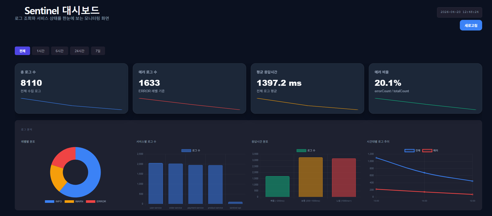
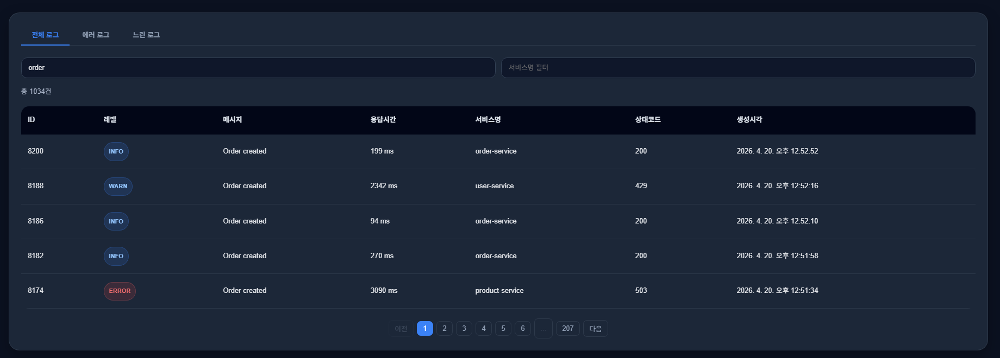
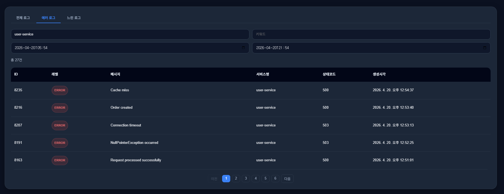
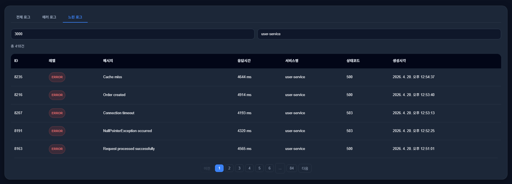
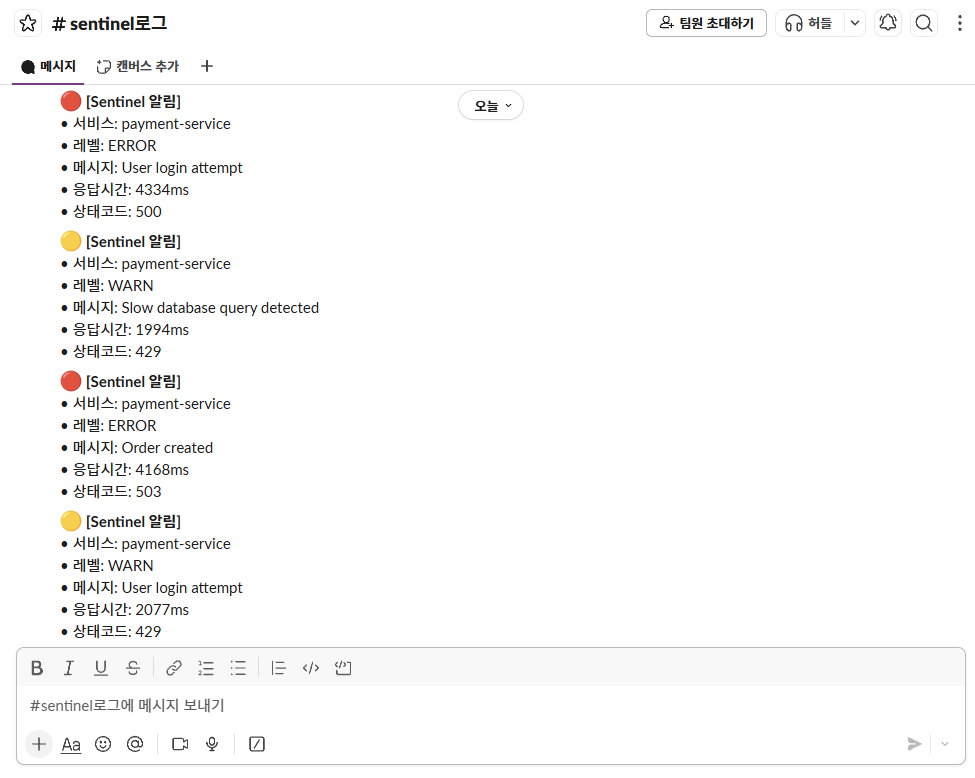
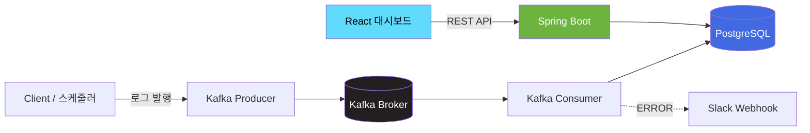
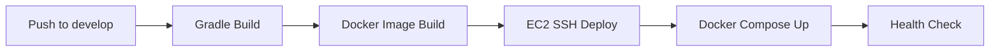

# 🔍 Sentinel

> Kafka 기반 로그 수집/시각화 APM 시스템  
> "내 서비스가 지금 어떤 상태인지, 한눈에 보고 싶다"에서 시작한 프로젝트예요.


---

## ✨ 이런 프로젝트예요

서비스 운영하다 보면 이런 순간 있잖아요 🤔

- "어제 우리 서비스 에러 많이 났나?"
- "유난히 느린 API 있는데 어떤 거지?"
- "장애 났는데 Slack 에 바로 알림 오면 좋겠다"

**Sentinel** 은 이 세 가지 질문에 답하기 위해 만든 **로그 모니터링 APM** 이에요.  
Kafka 로 로그를 모으고, 대시보드에서 실시간으로 확인하고, 심각한 에러는 Slack 으로 바로 받아볼 수 있어요.

---

## 🚀 성과 & 개선 포인트

> 💡 **"클라이언트 중심 처리 → 서버/DB 중심 구조로 전환하여 정확성과 확장성 개선"**

단순히 "만들어봤다" 가 아니라 **문제를 해결하면서 개선한 것들** 이에요.

### 📊 아키텍처 개선
| 항목 | 개선 전 | 개선 후 |
| --- | --- | --- |
| **로그 집계 방식** | 클라이언트에서 100건 받아서 filter/reduce | DB에서 `GROUP BY` 로 전체 집계 |
| **데이터 정확성** | 샘플(100건) 기준 통계 | 전체 데이터 기준 통계 |
| **검색 API** | 조건 조합마다 별도 `@Query` | JPA Specification 동적 조립 |
| **페이징** | 클라이언트 sliced rendering | 서버 페이징 + 디바운싱(300ms) |
| **시간대 관리** | 환경마다 제각각 (KST/UTC 혼재) | 전 구간 UTC 통일 |

### 📈 품질 지표 (측정 예정)
- 로그 조회 API `p95` 응답시간
- 집계 API vs 조회 API 응답시간 차이
- Redis 캐싱 적용 전/후 응답시간 비교
- Kafka 처리량 (msg/sec)

> 🧪 10만 건 시나리오 부하 테스트 준비 중 (k6). 실측되면 여기 업데이트 예정.

### 🐛 버그 해결
- **UTC 시간대 불일치** — EC2(UTC) vs 로컬(KST) 환경 차이로 시간 필터 전부 0건 나오던 버그를 JPA/Jackson/JVM 세 군데 모두 UTC 로 통일해서 해결
- **컨테이너 좀비 프로세스** — IDE 종료 ≠ Docker 종료. 개발 환경 종료 체크리스트 마련

---

## 🎬 미리보기

### 📊 대시보드
통계 카드 + 시간별 차트 + 서비스별 분포를 한눈에.



### 📋 전체 로그 조회
키워드/서비스명 필터. 타이핑 멈추면 300ms 후 자동 조회. 서버 페이징으로 대용량 데이터도 빠르게.



### 🚨 에러 로그 필터
ERROR 레벨 + 서비스명 + 시간 범위 복합 필터링.



### 🐌 느린 로그 추적
응답시간 threshold 조정으로 느린 API 즉시 식별.



### 🔔 Slack 실시간 알림
ERROR 레벨 발생 시 Webhook 으로 즉시 발송.



---

## 🏗 아키텍처



### 🔥 Kafka 를 쓴 이유 (현재 규모 기준)

> 💡 현재는 스케줄러 기반 로그 생성 수준이라 Kafka 가 필수는 아니지만,  
> 추후 트래픽 증가 상황을 고려해 **선제적으로 구조 분리 경험을 위해 도입**했어요.

**동기 처리 시 우려:**
- 로그 생성 → DB INSERT 까지 **동기 대기** → 본 서비스 응답 지연
- 대량 로그 발생 시 DB 커넥션 고갈 가능
- 수집 실패 시 본 서비스에도 영향

**Kafka 도입 후:**
- Producer: 로그만 토픽에 던짐 (< 1ms)
- Consumer: 별도로 DB 저장 + 알림 발송
- **수집 장애 ≠ 서비스 장애** (메시지는 큐에 보존됨)
- 추후 Consumer 만 수평 확장 가능

---

## 🛠 기술 스택

### 백엔드
- ☕ **Java 21 + Spring Boot 4.x** — 최신 버전 학습 겸 채택 _(실무에선 LTS 3.x 권장)_
- 🗄 **PostgreSQL 16** — JPA + Specification 으로 동적 쿼리
- 📬 **Apache Kafka 3.7** — 수집/조회 경로 분리
- 🔔 **Slack Webhook** — 실시간 알림

### 프론트엔드
- ⚛ **React 19 + Vite** — 빠른 개발/빌드
- 📊 **Chart.js** — 도넛/라인 차트
- 🎨 **순수 CSS (다크 테마)** — 디자인 라이브러리 의존 최소화

### 인프라
- 🐳 **Docker Compose** — 로컬/프로덕션 일관된 환경
- ☁ **AWS EC2** — 단일 인스턴스 통합 배포
- 🌐 **Nginx + Let's Encrypt** — HTTPS
- 🤖 **GitHub Actions** — develop 브랜치 푸시 시 자동 배포

---

## ⭐ 주요 기능

### 📈 실시간 대시보드
- **통계 카드** — 총 로그 / 에러 수 / 평균 응답시간 / 에러 비율
- **시간별 추이** — 최근 N시간 로그 변화 (1시간 / 6시간 / 24시간 / 7일)
- **레벨별 분포** — INFO / WARN / ERROR 도넛 차트
- **서비스별 분포** — 동적으로 확장되는 서비스 목록
- **응답시간 구간별** — 빠름(0-200ms) / 보통(200-1000ms) / 느림(1000ms+)

### 🔎 로그 검색 (3개 탭)

| 탭 | 기능 |
| --- | --- |
| 📋 **전체 로그** | 키워드 + 서비스명 + 시간 범위 통합 검색 |
| 🚨 **에러 로그** | ERROR 레벨 필터 + 상세 시간 지정 |
| 🐌 **느린 로그** | 응답시간 threshold 조정 (ms 단위) |

모든 탭에 **서버 페이징 + 디바운싱(300ms)** 적용.

### 🔔 Slack 실시간 알림
ERROR 레벨 로그 발생 시 Webhook 으로 즉시 발송.

---

## 🎯 설계 하이라이트

### 1. 🧬 A+B 하이브리드 DTO (record + Map)

집계 결과를 이렇게 분리했어요.

```java
public record LogStatsResponse(
    long totalCount,
    LevelDistribution levelDistribution,           // 🔒 고정 도메인 → record
    Map<String, Long> serviceDistribution,         // 🔓 동적 확장 → Map
    ResponseTimeBuckets responseTimeDistribution   // 🔒 고정 도메인 → record
) {
    public record LevelDistribution(long info, long warn, long error) { }
    public record ResponseTimeBuckets(long fast, long normal, long slow) { }
}
```

**왜 이렇게?**
- 레벨 / 응답시간 구간은 **고정** → `record` 로 타입 안전성 확보
- 서비스명은 **동적** → `Map` 으로 확장성 확보
- "Make invalid states unrepresentable" 원칙 적용

### 2. 🔧 JPA Specification 동적 검색

4가지 조건 (키워드 / 서비스 / 시간 시작 / 시간 끝) 조합이 **16가지** 인데, `@Query` 로는 유지보수 지옥이라 Specification 도입.

```java
Specification<LogEvent> spec = Specification
    .where(hasKeyword(keyword))
    .and(hasServiceName(serviceName))
    .and(createdAfter(startDate))
    .and(createdBefore(endDate));

return repository.findAll(spec, pageable).map(LogEventResponse::from);
```

**핵심 트릭**: 각 Specification 이 `null` 을 반환하면 Spring Data JPA 가 자동으로 WHERE 절에서 제외해요. 덕분에 조건 유무 체크 없이 동적 조립 가능.

### 3. 🌍 UTC 시간대 통일

로컬(KST) 개발 → EC2(UTC) 배포 시 **"어제 로그가 0건"** 같은 시간대 불일치 버그가 발생하기 쉬워요. 그래서 **전체 시스템을 UTC로 통일**:

```yaml
# application.yml
spring:
  jpa.properties.hibernate.jdbc.time_zone: UTC
  jackson.time-zone: UTC
```

```java
@PostConstruct
public void init() {
    TimeZone.setDefault(TimeZone.getTimeZone("UTC"));
}
```

프론트도 순수 UTC 로 전송하고, 표시할 때만 브라우저 로컬 시간으로 변환.

### 4. 📄 서버 페이징 + 디바운싱

기존: 클라이언트에서 100건 받아서 `filter` / `slice` → 데이터 늘면 성능 저하.

개선:
- **서버 페이징** — Spring Data `Page<T>` 활용, 필요한 페이지만 전송
- **디바운싱 300ms** — 타이핑 중 불필요한 API 호출 방지 (평균 5회 호출 → 1회)
- **URLSearchParams** — 조건 없으면 파라미터 자체를 빼서 쿼리 간결화

---

## ⚖ 트레이드오프 (솔직한 기술 선택 이야기)

완벽한 선택은 없으니까, **왜 이걸 선택했는지** 와 **포기한 것** 을 같이 적어요.

### Kafka (vs 직접 DB insert)
- 👍 **장점**: 비동기 처리, 수집/조회 경로 분리, 확장성
- 👎 **단점**: 운영 복잡도 증가 (Kafka 관리, 장애 포인트 증가)
- 🧭 **판단**: 단순 프로젝트 대비 오버엔지니어링 가능성 있지만, **이벤트 기반 구조 학습 + 추후 확장성 고려** 로 채택

### JPA Specification (vs QueryDSL, @Query 다중)
- 👍 **장점**: 동적 쿼리 조합 쉬움, 재사용 가능한 조각으로 관리
- 👎 **단점**: 복잡한 JOIN/서브쿼리 가독성 저하, JPQL 보다 디버깅 어려움
- 🧭 **판단**: 현재 단순 검색 위주라 Specification 이 적절. 복잡해지면 QueryDSL 고려.

### record + Map 하이브리드 DTO
- 👍 **장점**: 고정 도메인은 타입 안전, 동적 도메인은 유연성 확보
- 👎 **단점**: 완전 타입 안전성 일부 포기 (Map 부분은 오타 체크 안 됨)
- 🧭 **판단**: 서비스 목록은 동적이라 Map 이 불가피. 레벨/응답시간은 record 로 커버.

### 단일 EC2 통합 배포
- 👍 **장점**: 비용 저렴, 관리 단순
- 👎 **단점**: SPOF (Single Point of Failure), 수평 확장 어려움
- 🧭 **판단**: 포폴 규모에 적합. 트래픽 늘면 ALB + Auto Scaling 또는 ECS/EKS 로.

### 현재 Layered Architecture (vs Clean/Hexagonal)
- 👍 **장점**: Spring 과 궁합 좋음, 빠른 개발, 팀원 이해 쉬움
- 👎 **단점**: 도메인 로직이 기술에 의존적 (JPA 커플링)
- 🧭 **판단**: 현재 도메인 복잡도엔 오버 엔지니어링 방지. **다음 프로젝트(결제 시스템)에선 Clean Architecture 적용 예정**.

---

## 🚨 장애 대응 시나리오

> 💡 **로그 기반으로 "추측" 이 아니라 "데이터 기반" 으로 장애 원인 좁히는 것이 목표** — 이게 APM 의 본질이에요.

### 시나리오 1: 특정 서비스 에러율 급증
1. **Slack** 에 ERROR 알림 즉시 도착
2. **대시보드** 에서 해당 서비스 탭 클릭 → 시간대별 에러 추이 확인
3. **에러 로그 탭** 에서 메시지 패턴 검색 → 원인 범위 좁히기
4. 응답시간도 급증했다면 **느린 로그 탭** 으로 교차 확인

### 시나리오 2: 응답시간 점진적 악화
1. **시간별 추이 차트** 로 악화 시점 파악
2. **응답시간 분포** (fast/normal/slow) 비율 변화 확인
3. 서비스별 분포에서 **원인 서비스 식별**

### 시나리오 3: 로그 수집 자체 장애
1. DB 저장이 안 될 때, Kafka 의 메시지 보관 특성 덕분에 **유실 없음**
2. DB 이상 시 Consumer 일시 중단 → **메시지는 Kafka 에 보존**
3. 복구 후 Consumer 재시작하면 **끊긴 지점부터 이어서 처리**

---

## 📡 주요 API

| 메서드 | 경로 | 설명 |
| --- | --- | --- |
| `GET` | `/api/logs` | 로그 목록 (키워드/서비스/시간/페이징) |
| `GET` | `/api/logs/{id}` | 단일 로그 상세 |
| `GET` | `/api/logs/slow` | 느린 로그 (ms threshold + 서비스 필터) |
| `GET` | `/api/logs/stats` | 집계 통계 (분포 포함) |
| `GET` | `/api/logs/stats/hourly` | 시간대별 통계 |
| `POST` | `/api/logs` | 로그 수동 생성 (테스트용) |

응답 포맷은 Spring Data `Page<T>` 표준:
```json
{
  "content": [...],
  "page": {
    "size": 5,
    "number": 0,
    "totalElements": 8110,
    "totalPages": 1622
  }
}
```

---

## 🚀 로컬에서 실행하기

### 필요한 것
- Docker Desktop
- Java 21
- Node.js 20+

### 1️⃣ 인프라 띄우기 (PostgreSQL + Kafka)
```bash
cd infra
docker compose up -d
```

### 2️⃣ 백엔드 실행
```bash
cd backend
./gradlew bootRun
```

### 3️⃣ 프론트엔드 실행
```bash
cd sentinel-frontend
npm install
npm run dev
```

### 4️⃣ 접속
👉 http://localhost:5173

> 💡 **팁**: Docker 컨테이너는 별도 생명주기라 개발 종료 시 `docker compose down` 꼭 해주세요.  
> (IDE 끈다고 같이 안 꺼져요 🧟 — 직접 겪어봤습니다)

---

## 🤖 CI/CD

GitHub Actions 로 파이프라인 구성:



**develop 브랜치에 푸시되면** 자동으로 EC2 에 배포돼요.

---

## 📚 배우고 성장한 포인트

- 🧩 **Layered Architecture** — Controller / Service / Repository 관심사 분리
- 🔧 **JPA Specification** — 동적 쿼리의 정석
- 🧬 **record + Map 하이브리드** — 고정 도메인과 동적 도메인 분리 설계
- 🌍 **분산 환경의 시간대 통일** — UTC 전면 적용으로 환경 차이 제거
- ⚡ **비동기 이벤트 기반** — Kafka 로 수집 경로 분리
- 🎨 **React Custom Hook** — ViewModel 레이어로 UI 로직 재사용
- 💡 **트레이드오프 사고** — "왜 이걸 선택했고, 무엇을 포기했는가" 를 의식적으로 기록

---

## 🗺 로드맵

- [ ] 🧪 **성능 테스트** — k6 로 10만/100만 건 부하 테스트 → README 숫자 업데이트
- [ ] 🧬 **테스트 코드** — JUnit + Mockito + MockMvc
- [ ] 🔐 **인증/권한** — Spring Security + JWT
- [ ] 🚀 **Redis 캐싱** — 집계 API 응답 속도 개선
- [ ] 🤖 **LLM 연동** — 에러 자동 분석 / 자연어 로그 검색 / 일일 리포트
- [ ] 📊 **Prometheus + Grafana** — 메트릭 모니터링 계층 추가
- [ ] 🔍 **이상 탐지** — 에러율 / 응답시간 급증 자동 감지

---

## 📝 License

MIT

---

<div align="center">

**만든 사람** · [@dlawoghks99](https://github.com/dlawoghks99)

_버그 제보 / 기능 제안은 Issue 로 편하게 남겨주세요_ 🙋

</div>